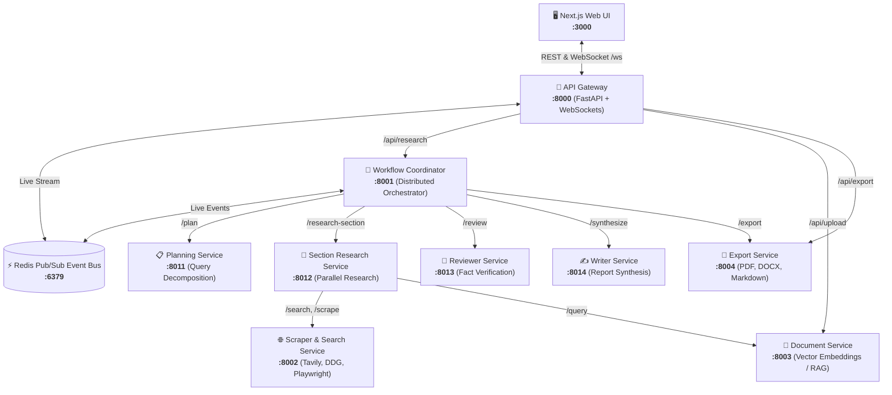

<div align="center" id="top">


####

[](https://gptr.dev)
[](https://docs.gptr.dev)
[](https://discord.gg/QgZXvJAccX)


[](https://badge.fury.io/py/gpt-researcher)

[](https://colab.research.google.com/github/assafelovic/gpt-researcher/blob/master/docs/docs/examples/pip-run.ipynb)
[](https://hub.docker.com/r/gptresearcher/gpt-researcher)
[](https://skills.sh/assafelovic/gpt-researcher/gpt-researcher)
[](https://twitter.com/assaf_elovic)

[English](README.md) | [中文](README-zh_CN.md) | [日本語](README-ja_JP.md) | [한국어](README-ko_KR.md)

</div>

# 🔎 GPT Researcher

**GPT Researcher is an open deep research agent designed for both web and local research on any given task.** 

The agent produces detailed, factual, and unbiased research reports with citations. GPT Researcher provides a full suite of customization options to create tailor made and domain specific research agents. Inspired by the recent [Plan-and-Solve](https://arxiv.org/abs/2305.04091) and [RAG](https://arxiv.org/abs/2005.11401) papers, GPT Researcher addresses misinformation, speed, determinism, and reliability by offering stable performance and increased speed through parallelized agent work.

**Our mission is to empower individuals and organizations with accurate, unbiased, and factual information through AI.**

## Why GPT Researcher?

- Objective conclusions for manual research can take weeks, requiring vast resources and time.
- LLMs trained on outdated information can hallucinate, becoming irrelevant for current research tasks.
- Current LLMs have token limitations, insufficient for generating long research reports.
- Limited web sources in existing services lead to misinformation and shallow results.
- Selective web sources can introduce bias into research tasks.

## Demo
<a href="https://www.youtube.com/watch?v=f60rlc_QCxE" target="_blank" rel="noopener">
  
</a>

## Install as Claude Skill

Extend Claude's deep research capabilities by installing GPT Researcher as a [Claude Skill](https://skills.sh/assafelovic/gpt-researcher/gpt-researcher):

```bash
npx skills add assafelovic/gpt-researcher
```

Once installed, Claude can leverage GPT Researcher's deep research capabilities directly within your conversations.

## 🏛️ Distributed Microservices Architecture

GPT Researcher is built as a fully decomposed, modular, containerized multi-agent microservices system communicating via high-throughput REST APIs and an asynchronous **Redis Pub/Sub Event Bus**:



### Microservices Directory & Port Breakdown

| Service | Port | Directory | Core Functionality |
|---|---|---|---|
| **Next.js Web UI** | `3000` | [`frontend/nextjs`](./frontend/nextjs) | Responsive React UI with real-time agent thought logs, interactive chat, and one-click report downloads. |
| **API Gateway** | `8000` | [`services/api_gateway`](./services/api_gateway) | Public entrypoint reverse proxy, WebSocket multiplexer, JSON history database, and chat endpoints. |
| **Workflow Coordinator** | `8001` | [`services/research_orchestrator`](./services/research_orchestrator) | High-speed distributed coordinator managing parallel agent tasks, token budgets, and Redis event streams. |
| **Planning Service** | `8011` | [`services/planning_service`](./services/planning_service) | Specialized agent decomposing broad research queries into structured subtopics and targeted search queries. |
| **Section Research Service** | `8012` | [`services/section_research_service`](./services/section_research_service) | Worker instances executing concurrent parallel web/doc retrieval and section draft generation. |
| **Reviewer Service** | `8013` | [`services/reviewer_service`](./services/reviewer_service) | Critique agent performing hallucination verification, quality scoring, and citation grounding checks. |
| **Writer Service** | `8014` | [`services/writer_service`](./services/writer_service) | Synthesis agent assembling cohesive, publication-grade markdown reports with formatted bibliography. |
| **Scraper & Search Service** | `8002` | [`services/scraper_service`](./services/scraper_service) | Threadpool search retrievers (Tavily, DuckDuckGo, Google) with in-memory TTL caching and headless scraping. |
| **Document Service** | `8003` | [`services/document_service`](./services/document_service) | Multi-format document parser (PDF, DOCX, TXT) and vector embedding similarity engine. |
| **Export Service** | `8004` | [`services/export_service`](./services/export_service) | Parallel multi-format document generator producing publication-ready PDF (WeasyPrint), DOCX, and Markdown. |
| **Redis Event Bus** | `6379` | `redis:7-alpine` | Low-latency pub/sub message broker for live WebSocket progress streaming and inter-service telemetry. |

---

## ⚙️ Quickstart with Docker Compose

The easiest way to run the entire microservices stack is with Docker Compose:

### 1. Clone & Configure Environment

```bash
git clone https://github.com/assafelovic/gpt-researcher.git
cd gpt-researcher
cp .env.example .env
```

Add your API keys to `.env`:
```env
OPENAI_API_KEY=your_openai_api_key
TAVILY_API_KEY=your_tavily_api_key
```

### 2. Start the Microservices Stack

```bash
docker compose up -d --build
```

Access the services:
- 🌐 **Web UI**: [http://localhost:3000](http://localhost:3000)
- 🔌 **API Gateway & Swagger Docs**: [http://localhost:8000/docs](http://localhost:8000/docs)
- 🔍 **Scraper Service Docs**: [http://localhost:8002/docs](http://localhost:8002/docs)

### 3. Run Container Composition Tests

To run the full suite of live container-to-container integration tests:

```bash
docker compose --profile test run --rm test-runner
```

---

## 💻 CLI & Python SDK

You can also run research directly via the standalone CLI or the Python SDK:

```bash
python cli.py "What are the latest advancements in quantum computing?"
```

## Run as PIP package
```bash
pip install gpt-researcher

```
### Example Usage:
```python
...
from gpt_researcher import GPTResearcher

query = "why is Nvidia stock going up?"
researcher = GPTResearcher(query=query)
# Conduct research on the given query
research_result = await researcher.conduct_research()
# Write the report
report = await researcher.write_report()
...
```

**For more examples and configurations, please refer to the [PIP documentation](https://docs.gptr.dev/docs/gpt-researcher/gptr/pip-package) page.**

### 🔧 MCP Client
GPT Researcher supports MCP integration to connect with specialized data sources like GitHub repositories, databases, and custom APIs. This enables research from data sources alongside web search.

```bash
export RETRIEVER=tavily,mcp  # Enable hybrid web + MCP research
```

```python
from gpt_researcher import GPTResearcher
import asyncio
import os

async def mcp_research_example():
    # Enable MCP with web search
    os.environ["RETRIEVER"] = "tavily,mcp"
    
    researcher = GPTResearcher(
        query="What are the top open source web research agents?",
        mcp_configs=[
            {
                "name": "github",
                "command": "npx",
                "args": ["-y", "@modelcontextprotocol/server-github"],
                "env": {"GITHUB_TOKEN": os.getenv("GITHUB_TOKEN")}
            }
        ]
    )
    
    research_result = await researcher.conduct_research()
    report = await researcher.write_report()
    return report
```

> For comprehensive MCP documentation and advanced examples, visit the [MCP Integration Guide](https://docs.gptr.dev/docs/gpt-researcher/retrievers/mcp-configs).

## 🍌 Inline Image Generation

GPT Researcher can automatically generate and embed AI-created illustrations in your research reports using Google's Gemini models (Nano Banana).

```bash
# Enable in your .env file
IMAGE_GENERATION_ENABLED=true
GOOGLE_API_KEY=your_google_api_key
IMAGE_GENERATION_MODEL=models/gemini-2.5-flash-image
```

When enabled, the system will:
1. Analyze your research context to identify visualization opportunities
2. Pre-generate 2-3 relevant images during the research phase
3. Embed them inline as the report is written

Images are generated with dark-mode styling that matches the GPT Researcher UI, featuring professional infographic aesthetics with teal accents.

[Learn more about Image Generation](https://docs.gptr.dev/docs/gpt-researcher/gptr/image_generation) in our documentation.

## ✨ Deep Research

GPT Researcher now includes Deep Research - an advanced recursive research workflow that explores topics with agentic depth and breadth. This feature employs a tree-like exploration pattern, diving deeper into subtopics while maintaining a comprehensive view of the research subject.

- 🌳 Tree-like exploration with configurable depth and breadth
- ⚡️ Concurrent processing for faster results
- 🤝 Smart context management across research branches
- ⏱️ Takes ~5 minutes per deep research
- 💰 Costs ~$0.4 per research (using `o3-mini` on "high" reasoning effort)

[Learn more about Deep Research](https://docs.gptr.dev/docs/gpt-researcher/gptr/deep_research) in our documentation.

## Run with Docker

> **Step 1** - [Install Docker](https://docs.gptr.dev/docs/gpt-researcher/getting-started/getting-started-with-docker)

> **Step 2** - Clone the '.env.example' file, add your API Keys to the cloned file and save the file as '.env'

> **Step 3** - Within the docker-compose file comment out services that you don't want to run with Docker.

```bash
docker-compose up --build
```

If that doesn't work, try running it without the dash:
```bash
docker compose up --build
```

> **Step 4** - By default, if you haven't uncommented anything in your docker-compose file, this flow will start 2 processes:
 - the Python server running on localhost:8000<br>
 - the React app running on localhost:3000<br>

Visit localhost:3000 on any browser and enjoy researching!


## 📄 Research on Local Documents

You can instruct the GPT Researcher to run research tasks based on your local documents. Currently supported file formats are: PDF, plain text, CSV, Excel, Markdown, PowerPoint, and Word documents.

Step 1: Add the env variable `DOC_PATH` pointing to the folder where your documents are located.

```bash
export DOC_PATH="./my-docs"
```

Step 2: 
 - If you're running the frontend app on localhost:8000, simply select "My Documents" from the "Report Source" Dropdown Options.
 - If you're running GPT Researcher with the [PIP package](https://docs.tavily.com/guides/gpt-researcher/gpt-researcher#pip-package), pass the `report_source` argument as "local" when you instantiate the `GPTResearcher` class [code sample here](https://docs.gptr.dev/docs/gpt-researcher/context/tailored-research).


## 🤖 MCP Server

We've moved our MCP server to a dedicated repository: [gptr-mcp](https://github.com/assafelovic/gptr-mcp).

The GPT Researcher MCP Server enables AI applications like Claude to conduct deep research. While LLM apps can access web search tools with MCP, GPT Researcher MCP delivers deeper, more reliable research results.

Features:
- Deep research capabilities for AI assistants
- Higher quality information with optimized context usage
- Comprehensive results with better reasoning for LLMs
- Claude Desktop integration

For detailed installation and usage instructions, please visit the [official repository](https://github.com/assafelovic/gptr-mcp).


## 👪 Multi-Agent Assistant
As AI evolves from prompt engineering and RAG to multi-agent systems, we're excited to introduce multi-agent assistants built with [LangGraph](https://python.langchain.com/v0.1/docs/langgraph/) and [AG2](https://github.com/ag2ai/ag2).

By using multi-agent frameworks, the research process can be significantly improved in depth and quality by leveraging multiple agents with specialized skills. Inspired by the recent [STORM](https://arxiv.org/abs/2402.14207) paper, this project showcases how a team of AI agents can work together to conduct research on a given topic, from planning to publication.

An average run generates a 5-6 page research report in multiple formats such as PDF, Docx and Markdown.

Check it out [here](https://github.com/assafelovic/gpt-researcher/tree/master/multi_agents) or head over to our documentation for [LangGraph](https://docs.gptr.dev/docs/gpt-researcher/multi_agents/langgraph) and [AG2](https://docs.gptr.dev/docs/gpt-researcher/multi_agents/ag2) for more information.

## 🔍 Observability

GPT Researcher supports **LangSmith** for enhanced tracing and observability, making it easier to debug and optimize complex multi-agent workflows.

To enable tracing:
1. Set the following environment variables:
   ```bash
   export LANGCHAIN_TRACING_V2=true
   export LANGCHAIN_API_KEY=your_api_key
   export LANGCHAIN_PROJECT="gpt-researcher"
   ```
2. Run your research tasks as usual. All LangGraph-based agent interactions will be automatically traced and visualized in your LangSmith dashboard.

## 🖥️ Frontend Applications

GPT-Researcher now features an enhanced frontend to improve the user experience and streamline the research process. The frontend offers:

- An intuitive interface for inputting research queries
- Real-time progress tracking of research tasks
- Interactive display of research findings
- Customizable settings for tailored research experiences

Two deployment options are available:
1. A lightweight static frontend served by FastAPI
2. A feature-rich NextJS application for advanced functionality

For detailed setup instructions and more information about the frontend features, please visit our [documentation page](https://docs.gptr.dev/docs/gpt-researcher/frontend/introduction).

## 🚀 Contributing
We highly welcome contributions! Please check out [contributing](https://github.com/assafelovic/gpt-researcher/blob/master/CONTRIBUTING.md) if you're interested.

Please check out our [roadmap](https://trello.com/b/3O7KBePw/gpt-researcher-roadmap) page and reach out to us via our [Discord community](https://discord.gg/QgZXvJAccX) if you're interested in joining our mission.
<a href="https://github.com/assafelovic/gpt-researcher/graphs/contributors">
  
</a>
## ✉️ Support / Contact us
- [Community Discord](https://discord.gg/spBgZmm3Xe)
- Author Email: assaf.elovic@gmail.com

## 🛡 Disclaimer

This project, GPT Researcher, is an experimental application and is provided "as-is" without any warranty, express or implied. We are sharing codes for academic purposes under the Apache 2 license. Nothing herein is academic advice, and NOT a recommendation to use in academic or research papers.

Our view on unbiased research claims:
1. The main goal of GPT Researcher is to reduce incorrect and biased facts. How? We assume that the more sites we scrape the less chances of incorrect data. By scraping multiple sites per research, and choosing the most frequent information, the chances that they are all wrong is extremely low.
2. We do not aim to eliminate biases; we aim to reduce it as much as possible. **We are here as a community to figure out the most effective human/llm interactions.**
3. In research, people also tend towards biases as most have already opinions on the topics they research about. This tool scrapes many opinions and will evenly explain diverse views that a biased person would never have read.

---

<p align="center">
<a href="https://star-history.com/#assafelovic/gpt-researcher">
  <picture>
    <source media="(prefers-color-scheme: dark)" srcset="https://api.star-history.com/svg?repos=assafelovic/gpt-researcher&type=Date&theme=dark" />
    <source media="(prefers-color-scheme: light)" srcset="https://api.star-history.com/svg?repos=assafelovic/gpt-researcher&type=Date" />
    
  </picture>
</a>
</p>


<p align="right">
  <a href="#top">⬆️ Back to Top</a>
</p>
